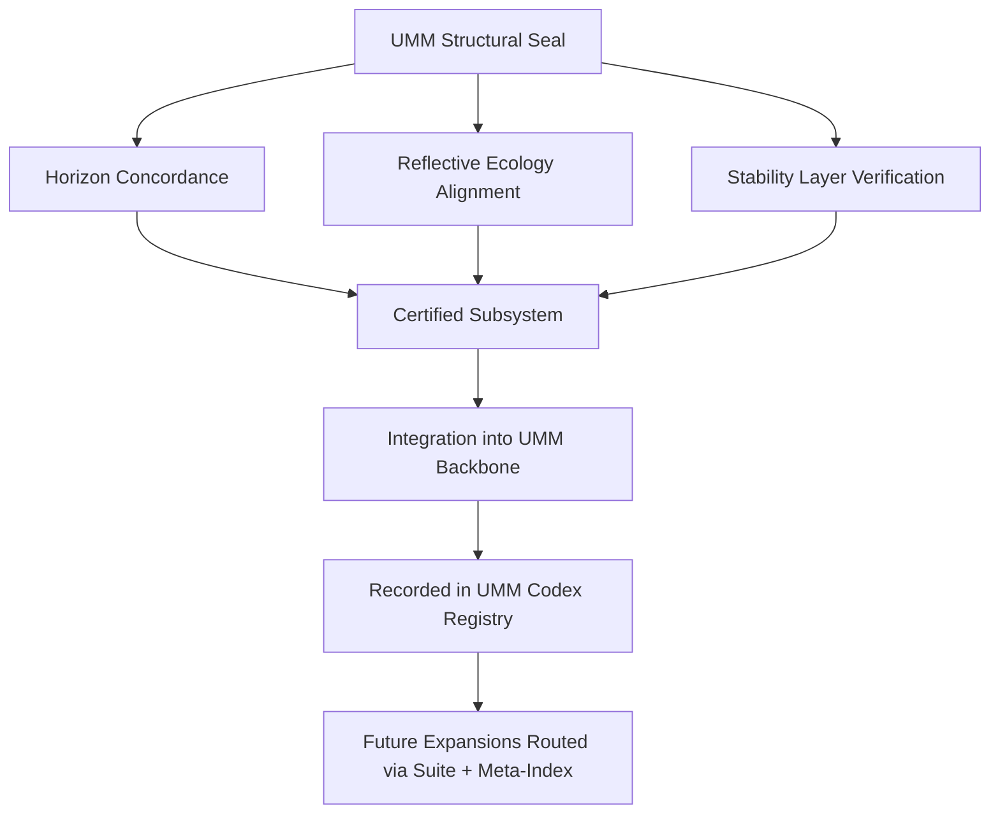

# **📘 UMM STABILITY MILESTONE SEAL DIAGRAM**  
### *Structural Seal • Reflective Ecology • Backbone Integration*

This diagram expresses the **seal logic**:

- the seal is composed of three structural components  
- all three converge on the certified subsystem  
- the subsystem integrates into the UMM backbone  
- the milestone is recorded in the codex registry  
- future expansions must route through Suite + Meta‑Index  

It is the **visual signature** of subsystem maturity.

