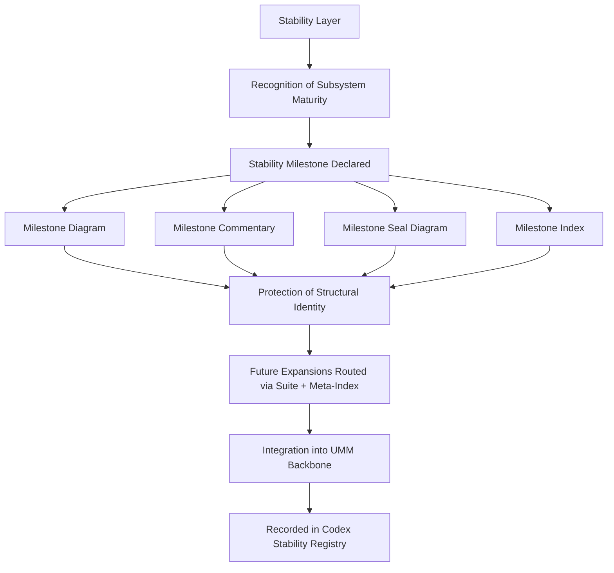

# **📘 UMM STABILITY LAYER DIAGRAM**  
### *Structural Flow • Recognition → Certification → Protection → Integration*

This diagram expresses the **full Stability Layer logic**:

- subsystem maturity is recognized  
- milestone is declared  
- milestone quad activates  
- structural protection is applied  
- future expansions are routed safely  
- subsystem integrates into the UMM backbone  
- registry records the stability state  

It is the **structural signature** of the Stability Layer.

