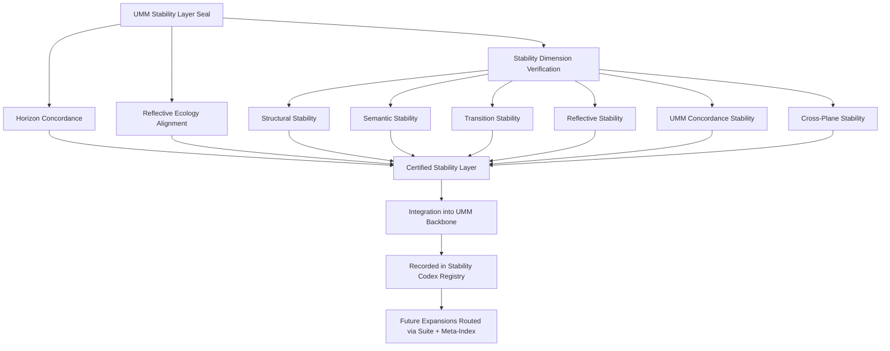

# **📘 UMM STABILITY LAYER SEAL DIAGRAM**  
### *Structural Seal • Layer‑Wide Verification • Backbone Integration*

This diagram expresses the **layer‑level seal logic**:

- the seal is composed of horizon concordance, reflective alignment, and stability verification  
- all six stability dimensions converge on the Stability Layer  
- the Stability Layer is certified as a mature subsystem  
- the layer integrates into the UMM backbone  
- the registry records the seal  
- future expansions must route through Suite + Meta‑Index  

It is the **visual signature** of Stability Layer maturity.

