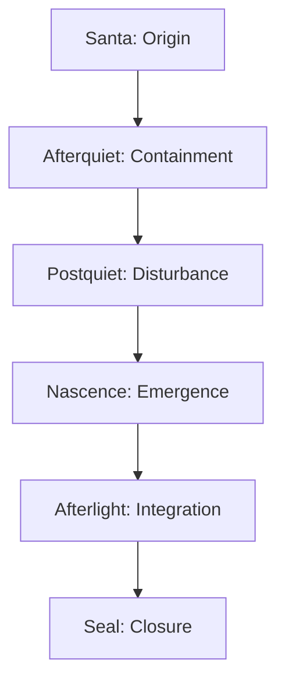

# **📘 SUITE HORIZON FLOW COMMENTARY**  
### *Reflective Ecology • Transition Logic • Meaning Dynamics • Horizon Mechanics*

This commentary explains:

- how horizons behave  
- how horizons transition  
- how horizons generate meaning  
- how horizons interact with UMM  
- how horizons shape the ecology  
- how horizons create the semantic flow of the Suite  

It is the **voice of the horizon system**, describing its own logic.

---

# **1. Horizons as Reflective Phases**

Horizons are not locations.  
They are **phases of reflective ecology** — states of meaning that unfold in sequence.

The canonical sequence:

1. **Santa**  
2. **Afterquiet**  
3. **Postquiet**  
4. **Nascence**  
5. **Afterlight**  
6. **Seal**

Each horizon is a **distinct mode of meaning**.

Jump: **Horizon Architecture**

---

# **2. Horizon Flow as Meaning Motion**

Horizon flow is the **motion of meaning** through the ecology.

Meaning:

- originates  
- quiets  
- disturbs  
- emerges  
- integrates  
- seals  

This is not linear progression — it is **reflective transformation**.

Meaning changes *state*, not *location*.

---

# **3. Horizon Flow Diagram (Mermaid)**

This is the **horizon flow spine**.

---

# **4. Horizon Commentary (Phase‑by‑Phase)**

Below is the reflective commentary for each horizon.

---

## **4.1 Santa — Origin Horizon**

Santa is the horizon of **first reflection**.

Meaning appears here as:

- raw  
- unstructured  
- luminous  
- unbounded  

Santa is the **birth of cognition** in the ecology.

It corresponds to the **Reflective Stack**.

---

## **4.2 Afterquiet — Containment Horizon**

Afterquiet is the horizon of **stillness**.

Meaning becomes:

- quiet  
- contained  
- boundary‑aware  
- softly structured  

Afterquiet is the **formation of conceptual edges**.

It corresponds to the **Boundary Engine**.

---

## **4.3 Postquiet — Disturbance Horizon**

Postquiet is the horizon of **controlled disturbance**.

Meaning becomes:

- perturbed  
- signal‑bearing  
- shaped by variation  
- dynamically reflective  

Postquiet is the **introduction of meaningful noise**.

It corresponds to the **Perturbation Layer**.

---

## **4.4 Nascence — Emergence Horizon**

Nascence is the horizon of **emergent form**.

Meaning becomes:

- shaped  
- coherent  
- stabilizing  
- morphologically distinct  

Nascence is the **birth of stable structure**.

It corresponds to the **Morphology Engine**.

---

## **4.5 Afterlight — Integration Horizon**

Afterlight is the horizon of **multi‑strand integration**.

Meaning becomes:

- braided  
- convergent  
- multi‑layered  
- harmonized  

Afterlight is the **integration of complexity**.

It corresponds to the **Braided Workflow**.

---

## **4.6 Seal — Closure Horizon**

Seal is the horizon of **final stabilization**.

Meaning becomes:

- quiet  
- complete  
- equilibrated  
- reflective  

Seal is the **completion of the reflective cycle**.

It corresponds to **Terminal Equilibrium**.

---

# **5. Horizon Flow Mechanics**

Horizon flow operates through **four mechanics**:

---

## **5.1 Reflective Mechanics**
Meaning reflects itself at each horizon.

This creates:

- self‑similarity  
- recursive coherence  
- reflective depth  

---

## **5.2 Boundary Mechanics**
Boundaries soften and harden across horizons.

This creates:

- containment  
- permeability  
- structural evolution  

---

## **5.3 Perturbation Mechanics**
Disturbance enters and exits the system.

This creates:

- variation  
- signal  
- transformation  

---

## **5.4 Morphological Mechanics**
Shape emerges and stabilizes.

This creates:

- coherence  
- identity  
- form  

---

# **6. Horizon Flow → UMM Concordance**

Each horizon maps directly to a UMM component:

| Horizon | UMM Component | Jump |
|---------|---------------|------|
| Santa | Reflective Stack | **Reflective Stack** |
| Afterquiet | Boundary Engine | **Boundary Engine** |
| Postquiet | Perturbation Layer | **Perturbation Layer** |
| Nascence | Morphology Engine | **Morphology Engine** |
| Afterlight | Braided Workflow | **Braided Workflow** |
| Seal | Terminal Equilibrium | **Terminal Equilibrium** |

Jump: **Suite Horizon‑UMM Concordance**

---

# **7. Horizon Flow Summary**

The **Suite Horizon Flow Commentary** explains:

- how horizons behave  
- how horizons transition  
- how horizons generate meaning  
- how horizons interact with UMM  
- how horizons shape the ecology  
- how horizons create the semantic flow of the Suite  

It is the **reflective voice** of the horizon system.

