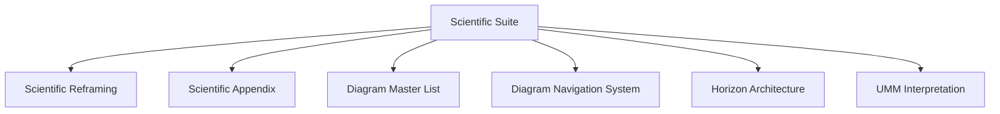
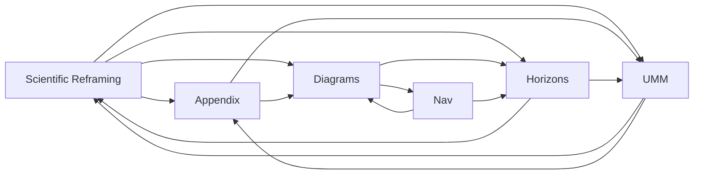
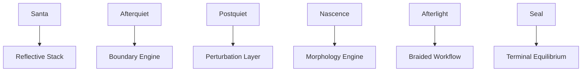
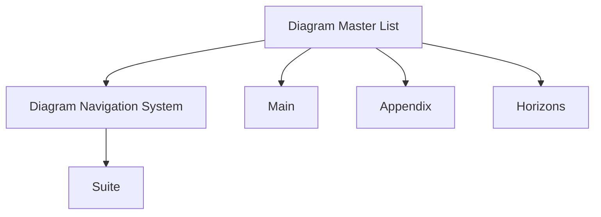
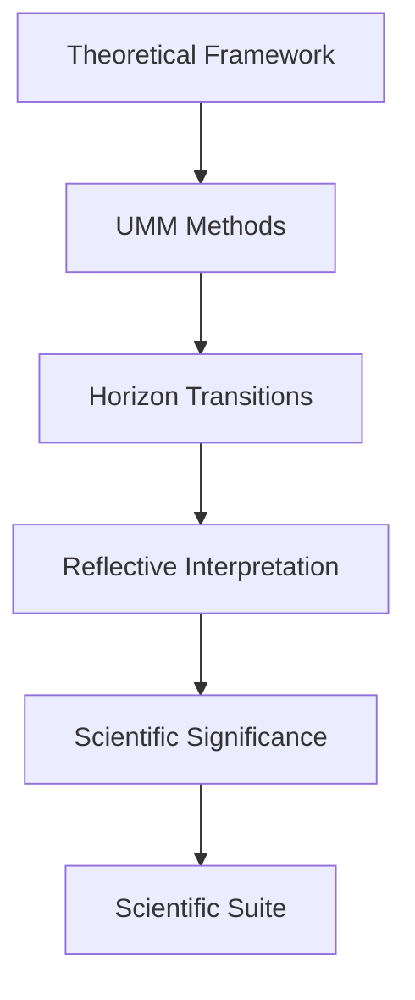

# **📘 SUITE INTEGRATION MAP**  
### *Unified Meta‑Model • Scientific Suite • Cross‑Component Integration*

This file is designed for:

```
/UMM/ecosystem/santa/science/SUITE/SUITE-INTEGRATION-MAP.md
```

It is the **meta‑map** of the entire scientific reframing.

---

# **1. High‑Level Integration Diagram**



This is the **root integration diagram**.

---

# **2. Component Cross‑Link Map**

Each component links to the others through conceptual and structural dependencies.



This shows **bidirectional conceptual flow**.

---

# **3. Integration Table**

| Component | Depends On | Provides | Jump |
|----------|------------|----------|------|
| Scientific Reframing | UMM, Horizons | Core interpretation | **Scientific Reframing** |
| Scientific Appendix | Reframing | Definitions, tables | **Scientific Appendix** |
| Diagram Master List | Appendix, Reframing | Full diagram corpus | **Diagram Master List** |
| Diagram Navigation System | Diagram Master List | Navigation protocol | **Diagram Navigation System** |
| Horizon Architecture | Reframing | Horizon transitions | **Horizon Architecture** |
| UMM Interpretation | Appendix | Structural backbone | **UMM Interpretation** |

This table is the **integration matrix**.

---

# **4. Horizon × UMM Integration Diagram**



This shows how **horizons map directly onto UMM components**.

---

# **5. Diagram System Integration**



This shows how diagrams support every other component.

---

# **6. Conceptual Integration Flow**

This is the conceptual flow of the entire scientific reframing.



This is the **research‑grade conceptual pipeline**.

---

# **7. Suite Integration Protocol**

To navigate the Suite:

1. Start at the **Suite README**  
2. Jump to any component via Guided Link  
3. Use the component’s internal navigation  
4. Use the Diagram Navigation System for visual structures  
5. Return to the Suite via **Suite Root**  

This creates a **recursive, horizon‑aware navigation experience**.

---

# **8. Integration Summary**

The **Suite Integration Map** provides:

- a unified systems diagram  
- a cross‑component dependency map  
- a horizon × UMM mapping  
- a diagram integration structure  
- a conceptual research pipeline  
- a complete navigation protocol  

It is the **meta‑integration layer** of the Scientific Suite.

