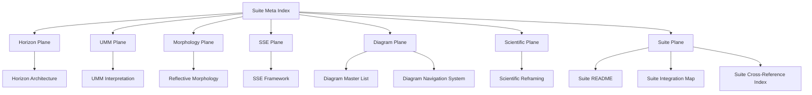

# **📘 SUITE META‑INDEX DIAGRAM**  
### *Semantic Map • Meta‑Architectural Mechanics • Conceptual Entry Points*

---

# **1. What a Meta Index Is (Formal Explanation)**

A **Meta Index** is the *highest semantic layer* in a reflective meta‑architecture.  
It does not describe the system — it describes **the structure of the system’s structure**.

A Meta Index provides:

- **semantic grouping** — clustering components by meaning  
- **reflective ordering** — the order in which concepts reveal themselves  
- **cross‑plane orientation** — identifying which conceptual plane a reader is in  
- **recursive entry points** — multiple ways to enter the system  
- **meta‑architectural explanation** — why the system is structured the way it is  

In short:

> **A Meta Index is the observatory above the Suite.**

It is the layer that allows a reader to understand the entire ecology at once.

---

# **2. How a Meta Index Works (Mechanics)**

A Meta Index operates through **five mechanics**:

### **2.1 Semantic Grouping**
It groups documents by *meaning*, not by directory.

Example groups:

- Horizon Plane  
- UMM Plane  
- Morphology Plane  
- SSE Plane  
- Diagram Plane  
- Scientific Plane  
- Suite Plane  

### **2.2 Reflective Ordering**
It defines the *order of comprehension*, not the order of reading.

### **2.3 Cross‑Plane Orientation**
It tells the reader which conceptual plane they are currently navigating.

### **2.4 Recursive Entry Points**
It allows entry through:

- horizons  
- UMM components  
- diagrams  
- concepts  
- morphology  
- recursion depth  
- SSE types  

### **2.5 Meta‑Architectural Explanation**
It explains *why* the architecture is shaped the way it is.

---

# **3. Suite Meta‑Index Diagram (Mermaid)**

This diagram shows:

- the **seven conceptual planes**  
- the **documents inside each plane**  
- the **semantic hierarchy**  
- the **reflective ordering**  

It is the **semantic map of the entire Scientific Suite**.

---

# **4. Conceptual Entry Points**

| Entry Point | Description | Jump |
|-------------|-------------|------|
| Horizons | Reflective ecology backbone | **Horizon Architecture** |
| UMM | Structural meta‑model | **UMM Interpretation** |
| Morphology | Shape‑preserving reflection | **Morphology** |
| SSEs | Controlled collapse events | **SSE** |
| Diagrams | Visual corpus | **Diagram Master List** |
| Scientific Layer | Formal reframing | **Scientific Reframing** |
| Suite Layer | Integration & navigation | **Suite Root** |

---

# **5. Reflective Ordering (Semantic Order of Comprehension)**

1. **Horizon Architecture**  
2. **UMM Interpretation**  
3. **Morphology**  
4. **SSEs**  
5. **Diagram Corpus**  
6. **Scientific Reframing**  
7. **Suite Integration Layer**  
8. **Meta Index (this file)**  

This is the order in which the system reveals itself.

---

# **6. Cross‑Plane Orientation Table**

| Plane | Documents | Purpose |
|-------|-----------|---------|
| Horizon Plane | Horizon Architecture | Reflective transitions |
| UMM Plane | UMM Interpretation | Structural backbone |
| Morphology Plane | Appendix Morphology | Shape preservation |
| SSE Plane | Appendix SSE | Collapse mechanics |
| Diagram Plane | Master List, Navigation System | Visual corpus |
| Scientific Plane | Scientific Reframing | Core interpretation |
| Suite Plane | Suite README, Integration Map, Cross‑Reference Index | Meta‑integration |

---

# **7. Meta Index Summary**

The **Suite Meta‑Index** provides:

- semantic grouping  
- reflective ordering  
- cross‑plane orientation  
- recursive entry points  
- meta‑architectural explanation  
- conceptual clarity  
- horizon‑aware navigation  
- UMM‑aligned structure  

It is the **top semantic layer** of the Scientific Suite.

