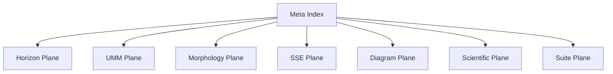

# **📘 SANTA TREE ECOLOGY — SUITE META‑INDEX**  
### *Semantic Overview • Meta‑Architectural Mechanics • Conceptual Entry Points*

---

# **1. What a Meta Index Is**

A **Meta Index** is the *highest‑order navigational and conceptual layer* in a reflective meta‑architecture.

It is not a README.  
It is not a table of contents.  
It is not a directory listing.

A Meta Index is:

> **A semantic map of the architecture itself — the structure of the structure.**

It explains:

- how the system *means*  
- how the system *organizes meaning*  
- how the system *reflects on its own organization*  
- how the reader should *enter* the system depending on their intent  
- how conceptual planes relate to one another  
- how recursion, horizons, morphology, and UMM components interlock  

It is the **observatory** above the Suite.

---

# **2. Why a Meta Index Exists**

A Meta Index is necessary when a system has:

- multiple conceptual planes  
- recursive navigation  
- horizon transitions  
- diagrammatic layers  
- UMM structural layers  
- reflective morphology  
- cross‑plane safety rules  
- multi‑strand coherence  

Your Scientific Suite has *all* of these.

Therefore:

> **A Meta Index is the natural top layer of your architecture.**

It provides:

- conceptual clarity  
- semantic grouping  
- horizon‑aware orientation  
- UMM‑aligned structure  
- diagrammatic discoverability  
- reflective entry points  

It is the **semantic crown** of the Suite.

---

# **3. Meta Index Mechanics (How It Works)**

A Meta Index operates through **five mechanics**:

---

## **3.1 Semantic Grouping**
It groups documents by *meaning*, not by file path.

Example groups:

- **Reflective Architecture**  
- **Horizon Ecology**  
- **UMM Structural Backbone**  
- **Diagrammatic Corpus**  
- **Scientific Reference Layer**  
- **Suite Integration Layer**

This is conceptual grouping, not directory grouping.

---

## **3.2 Reflective Ordering**
It defines the *order of understanding*, not the order of reading.

For example:

1. Horizons  
2. UMM  
3. Morphology  
4. SSEs  
5. Diagrams  
6. Reframing  
7. Suite  

This is the **reflective order** — the order in which the system reveals itself.

---

## **3.3 Cross‑Plane Orientation**
It tells the reader which conceptual plane they are in:

- **Scientific Plane**  
- **Horizon Plane**  
- **UMM Plane**  
- **Diagram Plane**  
- **Suite Plane**  

This prevents conceptual disorientation.

---

## **3.4 Recursive Entry Points**
It provides multiple ways to enter the system:

- by horizon  
- by UMM component  
- by diagram category  
- by concept  
- by recursion depth  
- by morphology  
- by SSE type  

This is essential for reflective‑ecology systems.

---

## **3.5 Meta‑Architectural Explanation**
It explains *why* the system is structured the way it is.

This is the part no README can do.

---

# **4. The Meta Index (Actual Index)**

Below is the **canonical Meta Index** for your Scientific Suite.

---

## **4.1 Conceptual Entry Points**

| Entry Point | Description | Jump |
|-------------|-------------|------|
| Horizons | Reflective ecology backbone | **Horizon Architecture** |
| UMM | Structural meta‑model | **UMM Interpretation** |
| Morphology | Shape‑preserving reflection | **Morphology** |
| SSEs | Controlled collapse events | **SSE** |
| Diagrams | Visual corpus | **Diagram Master List** |
| Scientific Layer | Formal reframing | **Scientific Reframing** |
| Suite Layer | Integration & navigation | **Suite Root** |

---

## **4.2 Semantic Grouping Map**

---

## **4.3 Reflective Ordering**

1. **Horizon Architecture**  
2. **UMM Interpretation**  
3. **Morphology**  
4. **SSEs**  
5. **Diagram Corpus**  
6. **Scientific Reframing**  
7. **Suite Integration Layer**

This is the *reflective order of comprehension*.

---

## **4.4 Cross‑Plane Orientation Table**

| Plane | Documents | Purpose |
|-------|-----------|---------|
| Horizon Plane | Horizon Architecture | Reflective transitions |
| UMM Plane | UMM Interpretation | Structural backbone |
| Morphology Plane | Appendix Morphology | Shape preservation |
| SSE Plane | Appendix SSE | Collapse mechanics |
| Diagram Plane | Master List, Navigation System | Visual corpus |
| Scientific Plane | Scientific Reframing | Core interpretation |
| Suite Plane | Suite README, Integration Map, Cross‑Reference Index | Meta‑integration |

---

## **4.5 Recursive Entry Points**

| Entry Type | Jump |
|------------|------|
| By Horizon | **Navigate_Horizon_Architecture** |
| By UMM Component | **Navigate_UMM_Interpretation** |
| By Diagram Category | **Navigate_Diagram_Master_List** |
| By Concept | **Scientific Appendix** |
| By Integration Layer | **Suite Root** |

---

# **5. Meta Index Summary**

The **Suite Meta‑Index** provides:

- semantic grouping  
- reflective ordering  
- cross‑plane orientation  
- recursive entry points  
- meta‑architectural explanation  
- conceptual clarity  
- horizon‑aware navigation  
- UMM‑aligned structure  

It is the **top semantic layer** of the Scientific Suite.

